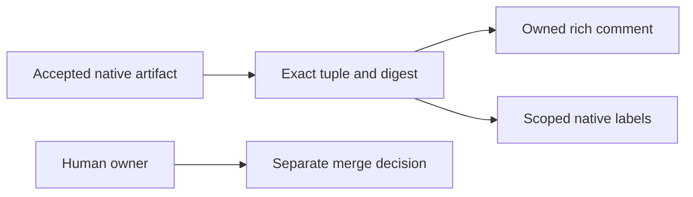

# Generated synthetic Markdown preview

This is generated Markdown, **not verified GitHub-rendered or deployed output**.
The example repository, run, review and evidence are synthetic.
Source: [fixture](../../tests/fixtures/clawsweeper-rich-report.md).

---

<!-- review-conductor:native-presentation-v1 -->
# ClawSweeper review

Native evaluation from the accepted report. Conductor status and human-only merge authority remain separate.

## What This Changes

> Carries accepted native findings, evidence and scores into the existing Conductor comment.
> Label reconciliation changes only explicitly supported native families.

## Review scores

| Dimension | Native tier | Score |
| --- | --- | --- |
| Overall | B · 🐚 platinum hermit | 4/6 |
| Proof | A · 🦞 diamond lobster | 5/6 |
| Patch | B · 🐚 platinum hermit | 4/6 |

Scores are the producer's categorical tier scale, not a new assessment.

## Rating explanation and next rank-up steps

> Overall tier: B
>
> Proof tier: A
>
> Patch tier: B
>
> The report assigns good normal readiness and stronger proof confidence.
>
> Next rank-up steps:
>
> - Add another user-facing example after the prerequisite stack lands.

## Verification

- Native proof status: sufficient
- Native evidence kind: recording

> Status: sufficient
>
> Evidence kind: recording
>
> The synthetic recording demonstrates a repeated publication tick updating no duplicate comment.

## Live proof

> Fixture only: no live GitHub rendering, runtime activation or device capture claimed.

## Evidence

> - Synthetic repeated-tick output: one owned comment and unchanged exact labels.
> - Synthetic negative case: tampered artifact rejected before publication.
> - Original native report remains in the accepted workflow artifact.

## How this fits together

> The accepted artifact crosses the digest boundary once. The runtime remains the sole publisher.

## Findings

> None. This synthetic clean fixture does not assert any deployed behavior.

## Security

> No synthetic security findings. The report cannot request secrets, merge authority or arbitrary labels.

## Next steps

> Keep Conductor status independent; preserve the original report digest and one publication owner.

## Native maintainer question

> No native question supplied. Merge remains a separate human-only action.

## Risks / Open Questions

> GitHub Mermaid rendering and production activation are intentionally unverified.

_Selected native public sections only; omitted internal metadata is retained in the original accepted artifact._

Original accepted report: [workflow artifacts](https://github.com/example/synthetic-review/actions/runs/801), `review/7.md`.

## Review Conductor projection

- Stage: ready_for_human_merge
- Review content: clean
- Process gates: owner_merge_authority
- Merge authorized: no (human_only)
- Exact head: `2222222222222222222222222222222222222222`
- Base: `1111111111111111111111111111111111111111`
- Epoch: 0
- Issuer: App 4916376
- Workflow run: https://github.com/example/synthetic-review/actions/runs/801
- Accepted artifact: `sha256:e3f50107948fb599db190dedc4dfab3f9e36fde9287e7e252606bea002f56611`
- Decision: human merge authority required

<!-- review-conductor:github-projection repo=example/synthetic-review pr=7 base=1111111111111111111111111111111111111111 head=2222222222222222222222222222222222222222 epoch=0 issuer=4916376 artifact=sha256:e3f50107948fb599db190dedc4dfab3f9e36fde9287e7e252606bea002f56611 -->
